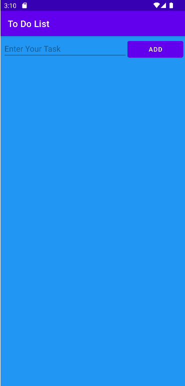
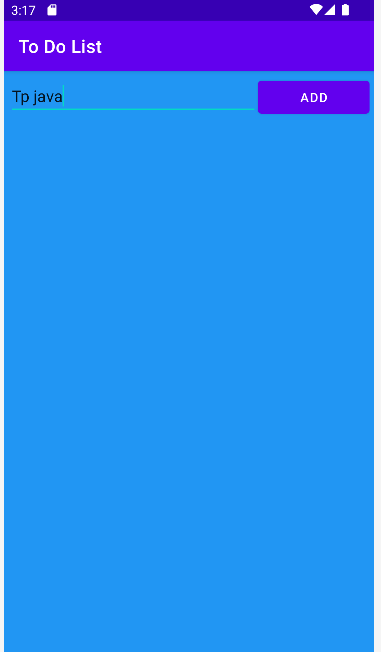
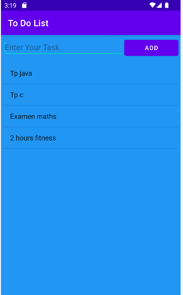
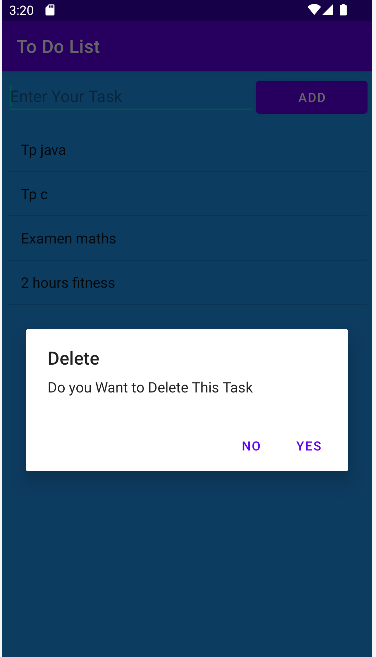
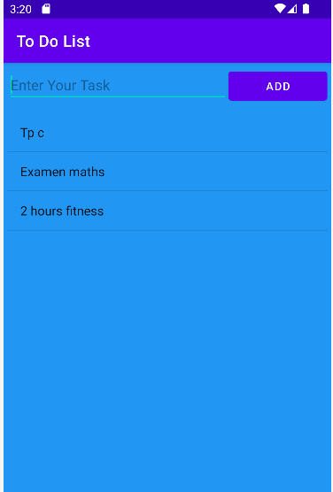

# Simple To-Do List App
A straightforward, user-friendly to-do list application for Android, written in Java. Manage your daily tasks with ease.
## Features
- Add Tasks: Enter a task and tap "Add" to add it to the list.
- Delete Tasks: Long-press on a task to delete it from the list.
- Persistent Storage: Tasks are saved locally and persist across app sessions.
- Alert Dialog: Confirm task deletion with an alert dialog for user confirmation.
## Installation
1. Clone the repository:
   ~~~~
   git clone https://github.com/HACHEM98/ToDoList-App.git
   ~~~~
2. Open the project in Android Studio.
3. Build and run the project on your Android device or emulator.
## Usage   
1. Adding a Task:
   - Type your task into the input field labeled "Enter Your Task".
   - Tap the "Add" button to add the task to the list.
2. Deleting a Task:
   - Long-press on a task in the list.
   - Confirm deletion in the alert dialog that appears.
3. Viewing Tasks:
   - Tasks are displayed in a simple list format.
## Screeshots

   
   
  
  
     

## Contributing
Contributions are welcome! Feel free to fork the repository and submit a pull request.

## License
This project is licensed under the MIT License - see the LICENSE file for details.

## Contact
Email-hachemslimene31@gmail.com
